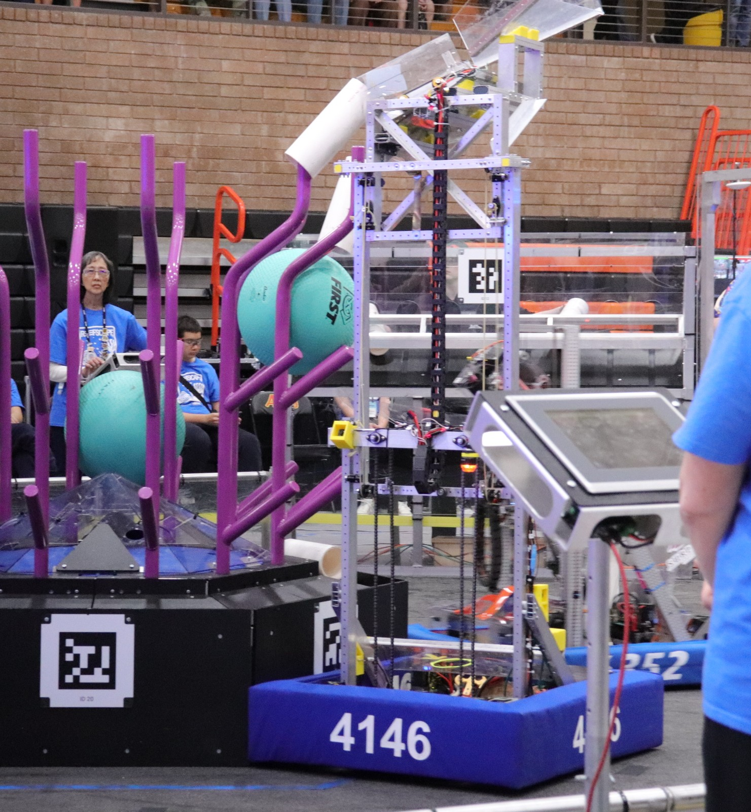
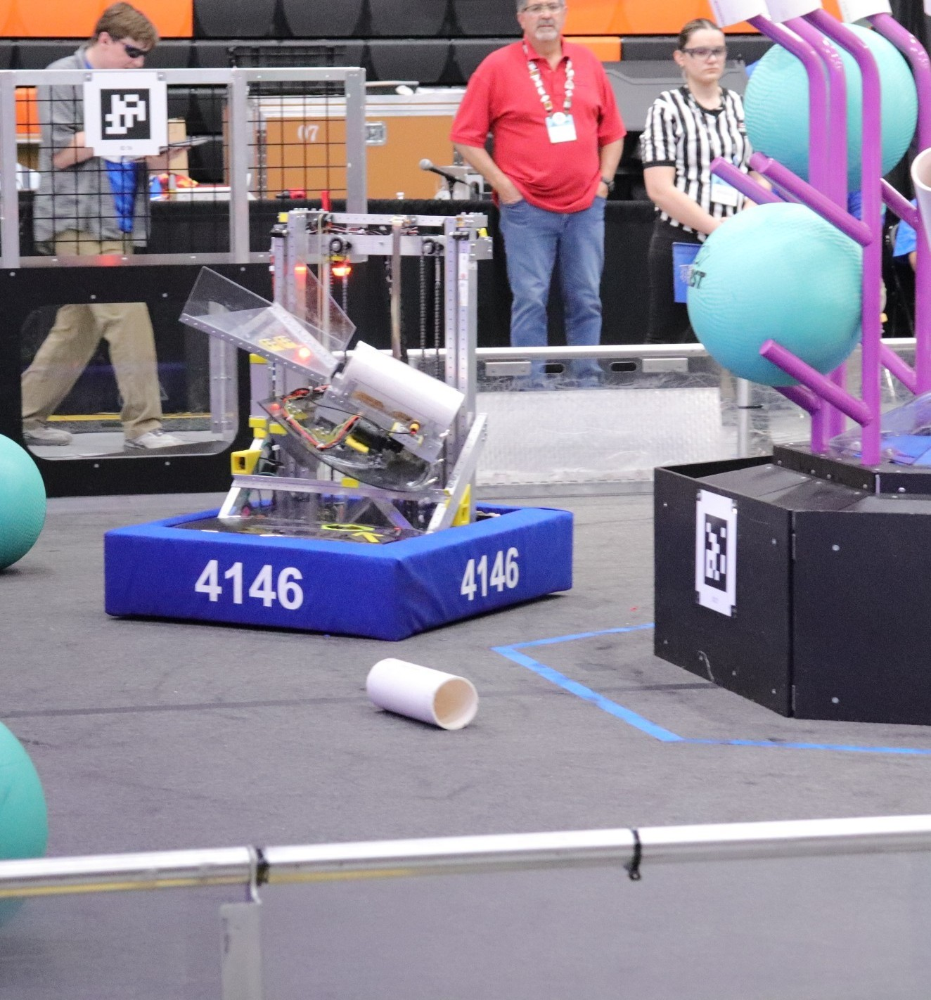

# Sabercat Robotics, Team 4146
## 2025 Competition Robot, *REEFSCAPE*

This repository contains the robot code for Team 4146's 2025 competition season.
It is a Java command-based WPILib project built on
[Az-RBSI](https://github.com/AZ-First/Az-RBSI) (Arizona's Reference Build and
Software Implementation), which derives from FRC 6328's
[AdvantageKit](https://github.com/Mechanical-Advantage/AdvantageKit) template.

The contents of `frc.robot.subsystems.{elevator, indexer, squidward}`,
`frc.robot.commands.*`, and the auto-alignment layer are team-written. The
drivetrain, vision, logging, and power-monitoring infrastructure is inherited
from the template and configured for our hardware.

---

## Table of Contents

- [The Robot](#the-robot)
- [Design Overview](#design-overview)
- [Software Architecture](#software-architecture)
- [Subsystems](#subsystems)
  - [Drivetrain](#drivetrain)
  - [Auto-Alignment](#auto-alignment)
  - [Elevator](#elevator)
  - [Indexer](#indexer)
  - [Squidward](#squidward-algae-removal-arm)
  - [Vision](#vision)
  - [Virtual Subsystems](#virtual-subsystems)
- [Command Compositions](#command-compositions)
- [Autonomous](#autonomous)
- [Driver Controls](#driver-controls)
- [Logging and Tuning](#logging-and-tuning)
- [Hardware Map](#hardware-map)
- [Repository Layout](#repository-layout)
- [Building and Deploying](#building-and-deploying)
- [Known Limitations and Future Work](#known-limitations-and-future-work)
- [Credits and Licensing](#credits-and-licensing)

---

## The Robot

The robot consists of a swerve chassis, a coral scoring elevator, a roller
indexer with a servo-driven retention gate, and a swinging algae-removal arm
referred to throughout the code as **Squidward**.

<p align="center">
  
  &nbsp;
  
</p>

| Element | Implementation |
|---|---|
| Drivetrain | 4× swerve modules, Kraken X60 drive and steer, CANcoder azimuth, Pigeon 2 IMU, all on a CANivore bus |
| Elevator | 2× Kraken X60 (leader/follower), Motion Magic position control, bottom limit switch for re-zeroing |
| Indexer | 1× Kraken X60 roller, IR beam-break, PWM linear actuator gate |
| Squidward | 1× Kraken X60 driving a swinging arm, Motion Magic with arm-cosine gravity compensation |
| Vision | 2× PhotonVision coprocessor cameras (implemented, currently disabled; see [Vision](#vision)) |
| Control | 2× Xbox controllers (driver and operator) |

Frame geometry from `TunerConstants`: modules are located at ±10.375 in in both
X and Y, giving a 20.75 in square wheelbase. Wheel radius is 2 in, drive
reduction 6.746:1, steer reduction 21.43:1, theoretical free speed 4.73 m/s at
12 V.

---

## Design Overview

**Single-input scoring.** Pressing **X** on the driver controller executes a
complete scoring cycle: home the elevator, drive to the nearest reef branch on
the operator-selected side, raise to the operator-selected level, wait for the
elevator to settle, eject the coral, retract, and re-home. The driver controls
timing; the operator controls target side and height.

**Pose-library auto-alignment.** Alignment targets come from a hard-coded table
of 28 measured field poses (12 left branches, 12 right branches, 4 feeder
stations) rather than from live AprilTag bearings. The robot selects the entry
nearest its current pose estimate and drives to it under a profiled polar
controller. This remains functional when a tag leaves the camera field of view,
and it confines field calibration to a single file.

**Algae level encoded in the pose table.** The reef alternates high and low algae
between faces. Each right-branch entry carries an `AlgaeLevel` value, so
`ClearAlgae` determines the required Squidward motion from odometry alone,
without additional sensing or operator input.

**Overlapped alignment and elevator travel.** Alignment commands are
instantaneous: they submit a goal pose to the drivetrain and finish. The
drivetrain closes the loop in its own `periodic()`, so the elevator begins
travelling while the chassis is still approaching. Cycle time is bounded by the
longer of the two motions rather than their sum.

**Replay logging.** All subsystems are implemented over an AdvantageKit IO
layer, so match logs can be replayed off-robot and stepped through as though the
hardware were attached.

---

## Software Architecture

### Command-based with an IO abstraction layer

`Robot` extends AdvantageKit's `LoggedRobot`. `RobotContainer` constructs every
subsystem, registers the autonomous choosers and PathPlanner named commands, and
binds all controller buttons.

Each mechanism subsystem is divided into three files:

```
Elevator.java            ← control logic, state machine, tunable gains
ElevatorIO.java          ← interface + @AutoLog input struct
ElevatorIOTalonFX.java   ← real hardware (Phoenix 6 TalonFX)
```

The subsystem does not access a motor controller directly. It calls
`io.runPosition(...)`, and once per cycle calls `io.updateInputs(inputs)`
followed by `Logger.processInputs("Elevator", inputs)`. AdvantageKit's `@AutoLog`
annotation generates `ElevatorIOInputsAutoLogged` from the plain-Java input
struct, which handles serialization in both directions.

In replay mode, `processInputs` reads logged values back into the struct rather
than writing them out. Subsystem logic then re-executes against recorded sensor
data, and any `@AutoLogOutput` field can be inspected as it was during the match.

```
                  REAL                            REPLAY
   ┌──────────┐                        ┌──────────┐
   │ Hardware │──▶ IOImpl ──▶ inputs   │ WPILOG   │──▶ inputs
   └──────────┘                 │      └──────────┘        │
                                ▼                          ▼
                          Subsystem logic            Subsystem logic
                                │                          │
                                ▼                          ▼
                          motor output              recomputed outputs
                          + log to USB              (compare & debug)
```

### `RBSISubsystem` and virtual subsystems

Mechanism subsystems extend `RBSISubsystem`, an Az-RBSI subclass of
`SubsystemBase`, rather than `SubsystemBase` directly. The only addition is
`getPowerPorts()`, which allows `PowerMonitoring` to sum PDH channel currents per
mechanism.

Components that produce telemetry but own no actuators, namely `Accelerometer`
and `PowerMonitoring`, extend `VirtualSubsystem` instead. These are ticked
explicitly by `VirtualSubsystem.periodicAll()` at the top of `robotPeriodic()`,
ahead of the command scheduler, and are therefore not subject to
requirement-based scheduling.

### `Constants.java` as configuration switchboard

The top of `Constants` contains static enum selections that reconfigure large
portions of the program at compile time:

```java
private static RobotType   robotType   = RobotType.COMPBOT;    // DEVBOT, COMPBOT, SIMBOT
private static SwerveType  swerveType  = SwerveType.PHOENIX6;  // PHOENIX6, YAGSL
private static CTREPro     phoenixPro  = CTREPro.UNLICENSED;   // LICENSED, UNLICENSED
private static AutoType    autoType    = AutoType.PATHPLANNER; // PATHPLANNER, CHOREO
private static VisionType  visionType  = VisionType.NONE;      // PHOTON, LIMELIGHT, NONE
```

`SwerveConstants` reads `swerveType` in a static initializer and populates one
flat set of constants from either the Tuner X generated file or the YAGSL JSON.
The remaining drivetrain code is written against a single API and does not branch
on vendor. `RobotContainer` and `Drive` switch on `autoType` to build either a
PathPlanner `AutoBuilder` chooser or a Choreo `AutoFactory`.

The rest of `Constants` holds physical constants, PID sets, CAN and PDH port
assignments, camera transforms, and the field pose library.

### Live tuning

`LoggedTunableNumber` publishes a value to NetworkTables and reports when it
changes. Mechanism gains are declared this way:

```java
private static final LoggedTunableNumber kP = new LoggedTunableNumber("Elevator/kP", 0.55);
```

Each subsystem's `periodic()` checks `kP.hasChanged(hashCode())` and re-applies
the Slot 0 configuration when it has. `Constants.tuningMode` is `true` in this
build, so values are writable from AdvantageScope during a practice session
without redeploying.

---

## Subsystems

### Drivetrain

`Drive` is a Phoenix 6 swerve implementation using AdvantageKit-style odometry.

**Hardware layer.** Four `Module` objects wrap `ModuleIOTalonFX` instances.
`PhoenixOdometryThread` runs as a separate high-rate thread, sampling drive
position, steer position, and gyro yaw as a synchronized signal group. Because
the modules are on a CANivore, `SwerveConstants.kOdometryFrequency` resolves via
`isNetworkFD()` to **250 Hz** rather than the 100 Hz CAN 2.0 fallback.
`Drive.periodic()` acquires `odometryLock`, drains every buffered sample, and
feeds each into the `SwerveDrivePoseEstimator` with its own timestamp, so pose
accuracy is not limited to the 50 Hz main loop rate.

**Gyro fallback.** If the Pigeon 2 disconnects, the estimator integrates heading
from module deltas via `kinematics.toTwist2d(moduleDeltas)` and raises a Driver
Station alert. Operation degrades rather than stopping.

**Teleop driving.** The default command is `DriveCommands.fieldRelativeDrive`.
Joystick handling applies a 0.1 radial deadband to the magnitude of the
translation vector rather than per-axis, which avoids distorting diagonal input,
then squares the magnitude for finer control near center. Rotation is deadbanded
and squared with sign preserved. Alliance flipping is applied when the Driver
Station reports red.

The teleop drive command also checks `drive.isAutoAligning()` and issues no
velocities while an alignment is active, preventing the joystick and the
alignment controller from competing for the drivetrain.

**Characterization.** `DriveCommands` provides a feedforward characterization
routine (ramps voltage, least-squares fits kS and kV, prints the result), a wheel
radius characterization (spins in place and compares gyro delta to wheel delta),
and standard SysId quasistatic and dynamic routines. All are exposed as options
in the PathPlanner auto chooser.

### Auto-Alignment

#### Pose library

`Constants.RobotDesiredPositions` holds three arrays of `DesiredPosition`
records, each consisting of a name, a `Pose2d`, and an optional `AlgaeLevel`:

| Array | Count | Contents |
|---|---|---|
| `FEEDERS` | 4 | Both feeder stations on both alliance walls |
| `RIGHT_REEFS` | 12 | Right branch of each of the 12 reef faces, tagged TOP/BOTTOM for algae |
| `LEFT_REEFS` | 12 | Left branch of each of the 12 reef faces |

These are absolute blue-origin field coordinates measured on a physical field
rather than computed from the AprilTag layout. Every entry is passed through
`.transformBy(FieldOffsetCompensation.REEF)` or `.FEEDER` at construction:

```java
public final class FieldOffsetCompensation {
  public static final Transform2d REEF   = new Transform2d(new Translation2d(0, 0), new Rotation2d(0));
  public static final Transform2d FEEDER = new Transform2d(new Translation2d(0, 0), new Rotation2d(0));
}
```

Both are currently identity transforms. If alignment is consistently offset at an
event, for example due to a different field, a rebuilt bumper, or a tag layout
that measures slightly differently, the correction is two values in one file
applied uniformly to all 24 reef poses or all 4 feeder poses, rather than
re-measuring the full table.

#### Target selection

The alignment commands (`AlignNearestRightReef`, `AlignNearestLeftReef`,
`AlignNearestFeeder`, `AlignNearestTag`) share a common structure:

```java
@Override
public void execute() {
  double shortestDistance = 1000;
  Supplier<Pose2d> shortestPose = () -> new Pose2d();
  for (DesiredPosition reef : RIGHT_REEFS) {
    double distance = drive.getPose().getTranslation().getDistance(reef.pose.getTranslation());
    if (distance < shortestDistance) { shortestDistance = distance; shortestPose = () -> reef.pose; }
  }
  drive.setAutoAlignGoal(shortestPose, false);
}

@Override
public boolean isFinished() { return true; }
```

Each performs a linear scan for the nearest entry by Euclidean distance, submits
the goal to the drivetrain, and finishes. `AlignNearestTag` concatenates all
three arrays and is used in autonomous, where side selection is not meaningful.

Returning `true` from `isFinished()` is intentional. These commands do not
perform the alignment; they request it. The drivetrain closes the loop
asynchronously, which allows the elevator to move during the approach.

#### Controller

`AutoAlignController`, adapted from FRC 6328, does not run separate X and Y PID
loops. It operates in polar coordinates relative to the goal:

- One `ProfiledPIDController` on scalar distance-to-goal, driven toward zero
  (kP 15, kD 0.2, trapezoid-limited to 90 % of maximum linear speed).
- One `ProfiledPIDController` on heading with continuous input wrapping
  (kP 20, kD 0.08, limited to 80 % of maximum angular speed and acceleration).

The distance controller's output is a scalar speed, rotated into the robot-to-goal
direction and converted to field-relative chassis speeds. The approach path is
therefore a straight line to the goal regardless of approach angle, and the
trapezoidal profile applies to the actual path rather than to each axis
independently.

A feedforward blend term ramps the profile's own velocity in and out over the
0.2 m to 0.8 m band around the goal (`ffMinRadius` and `ffMaxRadius`), so the
robot cruises on profile velocity at range and transitions to pure feedback as it
closes.

**Convergence.** `atGoal()` requires the robot to hold within 0.02 m and 5°
continuously for 0.5 s, enforced by a `toleranceTimer` that resets whenever
either controller leaves tolerance. This rejects the case where the robot passes
through the setpoint and momentarily reads as on-target.

**Timeout.** `update()` self-terminates after 5 s regardless of convergence. If
the pose estimate is inaccurate or the robot is obstructed, the drivetrain
releases the goal and returns control to the driver.

`Drive.periodic()` runs the controller:

```java
if (isAutoAligning()) {
  runVelocity(autoAlignController.update());
}
```

### Elevator

Two Kraken X60s (leader ID 14, follower ID 15) in a Phoenix 6 `Follower`
configuration, under Motion Magic voltage control with an `Elevator_Static`
gravity feedforward. Cruise velocity 80, acceleration 70, 70 A stator limit.

**Two-tier position model.** The elevator tracks two separate position values,
which implements the division between driver and operator control:

- `selectedPose` is the position the operator has queued with the D-pad. Setting
  it does not produce motion.
- `elevatorDesiredPosition` is the position the elevator is currently driving to.

`RunElevatorCommand` promotes selected to desired and finishes when the elevator
arrives. The operator can therefore queue the next target mid-cycle without
affecting the current one, and a single **X** press consumes whatever is queued.

**Continuous setpoint re-issue.** `updatePosition()` is called from `periodic()`
every cycle rather than once at command start:

```java
if (!homing && homed && !manualOverride && !exceedsMaxCurrent) {
  switch (elevatorDesiredPosition) {
    case L4: runPosition(heightL4); break;
    case L3: runPosition(heightL3); break;
    ...
  }
}
```

The elevator holds its target across command interruptions and scheduler
transitions. The guard conditions suppress closed-loop control while homing,
before the elevator has homed at least once, while manual override is engaged,
and while the soft current limit is exceeded.

**Homing.** `goHome()` is a command factory that raises the `homing` flag,
suppressing closed-loop control, drives −0.2 V until the DIO 2 limit switch
trips, then zeroes the encoder and sets the target to `STOWED`. It is the first
step of nearly every composition and is scheduled by `terminateAll()`.

`periodic()` additionally re-zeroes whenever the debounced limit switch is closed
and the elevator is moving downward (`inputs.velocityRadPerSec < 0`), so encoder
drift self-corrects on any normal descent without a dedicated homing pass.

**Soft current limit.** Above the tunable `maxSoftCurrent` (80 A), the elevator
calls `io.stop()` and sets `exceedsMaxCurrent`, which gates `updatePosition()`.
This supplements the Phoenix stator limit for cases where the carriage jams or
contacts a hard stop.

**Setpoints and tolerance.** Positions are stored in motor radians:

| Position | Value | Tolerance band |
|---|---|---|
| `STOWED` | 0 | ±5 |
| `L1` | 20 | ±5 |
| `L2` | 40 | ±5 |
| `L3` | 79 | ±5 |
| `L4` | 146 | −10 … 0 (asymmetric) |
| `EXPLICIT` | arbitrary | ±5 |

The L4 band is one-sided because the setpoint is near the top of travel: the
elevator may report arrival slightly low but never above the setpoint. The
`EXPLICIT` state accepts an arbitrary height and is used by the scoring
compositions to reach 100 for the release motion before returning down.

**Manual override.** The driver's right bumper toggles `manualOverride`, which
substitutes direct voltage from the triggers (`LT × 6 − RT × 6` volts) for
closed-loop control. This provides a recovery path if the encoder or limit switch
malfunctions during a match.

### Indexer

One Kraken X60 (ID 16, 30 A supply limit, coast) drives the coral rollers, with
two sensors governing its behavior.

An **IR beam-break** on DIO 0, debounced 50 ms, is exposed as `hasGamePiece()`.

A **PWM linear actuator** on channel 1 is driven as a `Servo` with custom
microsecond bounds (`setBoundsMicroseconds(2000, 1, 1500, 0, 1000)`). It acts as
a gate that physically retains the coral, and it is driven from `periodic()`
rather than from a command:

```java
if (extended && hasGamePiece()) {
  linearActuator.setPosition(1);
} else {
  linearActuator.setPosition(-1);
}
```

The `hasGamePiece()` term prevents the gate from extending into an empty indexer
even if a command has left `extended` set. The sensor has final authority over
the actuator.

**Two-speed intake.** `IntakeCommand` samples the beam-break at `initialize()`
and selects its speed from that reading:

```java
public void initialize() { startingState = indexer.hasGamePiece(); }

public void execute() {
  if (startingState == true) { indexer.runVoltage(6); }   // clearing out
  else { indexer.runVoltage(1.8); }                        // pulling in
}

public boolean isFinished() { return indexer.hasGamePiece() != startingState; }
```

Starting empty, it runs at 1.8 V so the coral seats gently and finishes when the
beam breaks. Starting loaded, it runs at 6 V to eject and finishes when the beam
clears. One command covers both directions of the state transition and terminates
on a sensor edge rather than a timer.

Scoring ejects at 6 V. The operator's left trigger runs −2 V to clear jams.

### Squidward (algae removal arm)

Squidward is the algae removal mechanism: a swinging arm on a single Kraken X60
(ID 23) under Motion Magic voltage control with an **`Arm_Cosine`** gravity
feedforward, so holding torque scales with the cosine of arm angle. Cruise
velocity 120, acceleration 300, 40 A stator limit, brake mode, and a 30 A tunable
soft-current guard.

The arm zeroes at construction (`io.zeroPosition()` in the constructor), so
position 0 corresponds to the stowed position it was powered on in.

Target selection is driven by the pose library. The reef alternates algae between
the high and low positions face to face; rather than sensing this or requiring
operator input, each `RIGHT_REEFS` entry carries `AlgaeLevel.TOP` or
`AlgaeLevel.BOTTOM`, alternating around the hexagon. Squidward reads the value
from odometry:

```java
public AlgaeLevel getNearestAlgaeLevel(Pose2d pose) {
  double shortestDistance = 1000;
  AlgaeLevel shortestLevel = null;
  for (DesiredPosition reef : RIGHT_REEFS) {
    double distance = pose.getTranslation().getDistance(reef.pose.getTranslation());
    if (distance < shortestDistance) { shortestDistance = distance; shortestLevel = reef.algaeLevel; }
  }
  return shortestLevel;
}
```

`ClearAlgae` aligns to the nearest reef face and branches on that lookup:

```java
addCommands(
    new AlignNearestRightReef(drive, container),
    new ConditionalCommand(
        new ClearTop(squid, drive, container),
        new ClearBottom(squid, drive, container),
        () -> squid.getNearestAlgaeLevel(drive.getPose()) == AlgaeLevel.TOP));
```

The two motions differ in direction, magnitude, and dwell time:

| Command | Swing to | Dwell | Return |
|---|---|---|---|
| `ClearTop` | +100 | 1.5 s | 0 |
| `ClearBottom` | −120 | 3.0 s | 0 |

Both begin with a 1 s wait, allowing the drivetrain alignment loop to settle
before the arm swings.

### Vision

`VisionType` is set to `NONE` in this build, so `RobotContainer` constructs the
`Vision` subsystem with empty `VisionIO` stubs. The PhotonVision implementation
is complete and configured for two cameras; setting `Constants.visionType` to
`PHOTON` re-enables it.

The subsystem is generic over a varargs list of `VisionIO`, so camera count is a
constructor argument rather than a code change. Each pose observation is filtered
before reaching the estimator:

- Rejected if zero tags are visible.
- Rejected if a single-tag observation has ambiguity above 0.3.
- Rejected if |Z| exceeds 0.75 m.
- Rejected if the solved pose falls outside the field boundary.

Surviving measurements receive standard deviations scaled by
`distance² / tagCount`, so a distant single-tag reading is weighted far less than
a close multi-tag reading. MegaTag 2 observations receive a 0.5× linear
multiplier and an infinite angular multiplier: the estimator accepts MegaTag 2
translation but discards its rotation, since MegaTag 2 is supplied the gyro
heading and its rotation output carries no independent information.

Accepted and rejected poses are both logged, so filter tuning can be performed by
inspecting an AdvantageScope timeline.

Camera transforms, robot-relative, from `Constants.Cameras`:

| Camera | X | Y | Z | Yaw |
|---|---|---|---|---|
| 1 | 10.977 in | 15.503 in | 10.288 in | −45° |
| 2 | 11.063 in | −9.437 in | 10.288 in | +45° |

### Virtual Subsystems

**`PowerMonitoring`** polls the PDH through the AdvantageKit conduit each cycle.
It integrates total current into amp-hours consumed, estimates remaining battery
percentage against a capacity entered on the dashboard (18 Ah default, itself a
`LoggedTunableNumber`), sums drive and steer currents separately, and raises
alerts when total draw exceeds 120 A or any single port exceeds 40 A. Any
`RBSISubsystem` passed to its constructor also receives a per-mechanism current
total via `getPowerPorts()`.

**`Accelerometer`** reads both the RoboRIO's built-in accelerometer and the
Pigeon 2, rotates each into the robot frame using the orientation constants,
converts to m/s², and numerically differentiates to produce jerk. These values
are useful post-match for identifying collisions and correlating brownouts with
impacts.

---

## Command Compositions

Driver-triggered actions are implemented as `SequentialCommandGroup` subclasses
in `frc.robot.commands.composition`. They follow a common structure of home,
align, act, retract, home, so that every cycle begins and ends from a known
state.

### `Score`, the main teleop cycle

```java
addCommands(
    elevator.goHome(),
    new ConditionalCommand(
        new AlignNearestLeftReef(drive, container),
        new AlignNearestRightReef(drive, container),
        () -> side.get() == ScoreSide.LEFT),
    new RunElevatorCommand(elevator),
    new WaitUntilCommand(() -> elevator.getAtDesiredPose()),
    new RunIndexer(indexer),
    new WaitCommand(1.5),
    new StopIndexerCommand(indexer),
    new RunElevatorExplicit(elevator, 100),   // flick up to release
    new WaitCommand(0.2),
    new RunElevatorExplicit(elevator, 0.0),
    elevator.goHome());
```

The side is read through a `Supplier<ScoreSide>` bound to `RobotContainer`'s
`scoreSide` field, so the operator's B/X selection is sampled when the command
runs rather than when it was constructed at startup. The alignment command
finishes immediately, so `RunElevatorCommand` begins travelling while the chassis
is still approaching.

The `RunElevatorExplicit(100)`, wait, `RunElevatorExplicit(0.0)` sequence at the
end is a short upward motion that clears the coral off the branch before
retracting.

### Remaining compositions

| Command | Trigger | Behavior |
|---|---|---|
| `ScoreNoAlign` | Driver POV Up, auto `Score2` | Identical to `Score` without the alignment step; used when odometry is not trusted |
| `AutoScore` | Auto named command `Score` | As `Score`, but aligns to the nearest entry across all pose arrays via `AlignNearestTag` |
| `Feed` | Driver **A** (held) | Home the elevator, run `IntakeCommand` until the beam-break state flips, stop |
| `AutoFeed` | Auto named command | Home, retract the gate, align to nearest feeder, run rollers at 1.8 V, wait for `hasGamePiece()`, stop |
| `ClearAlgae` | Driver **Y** | Align to nearest reef face, then run `ClearTop` or `ClearBottom` per the pose table's algae tag |

### `terminateAll()`

Driver **B** calls `RobotContainer.terminateAll()`, which is also invoked from
`Robot.teleopInit()` to ensure a clean transition out of autonomous:

```java
public void terminateAll() {
  CommandScheduler.getInstance().cancelAll();
  m_drivebase.clearAutoAlignGoal();
  m_Elevator.goHome().schedule();
  m_indexer.stopVoltage();
  m_indexer.setExtended(false);
  m_squid.runPosition(0.0);
}
```

Cancelling the scheduler alone is insufficient, because auto-alignment runs in
`Drive.periodic()` and the indexer gate is driven from `Indexer.periodic()`;
neither is owned by a command. `terminateAll()` explicitly resets that
out-of-band state and re-homes the elevator, leaving the robot in a known
configuration rather than merely stopped.

---

## Autonomous

Autonomous uses **PathPlanner**. `AutoBuilder.buildAutoChooser()` populates a
`LoggedDashboardChooser` with every `.auto` file in the deploy directory,
alongside the SysId and characterization routines.

### Level chooser

A second dashboard chooser selects scoring height independently of the path:

```java
autoLevelChooser.addDefaultOption("L2", ElevatorPosition.L2);
autoLevelChooser.addOption("L4", ElevatorPosition.L4);
```

`Robot.autonomousInit()` writes the selection into the elevator's selected
position before scheduling the auto command. Because `RunElevatorCommand`
promotes selected to desired, every `Score` within every path scores at the
chosen level. One set of path files covers both heights, and the height can be
changed between matches from the Driver Station without redeploying.

### Named commands

| Name | Command |
|---|---|
| `Score` | `AutoScore`: align to nearest pose, raise, eject, retract |
| `Score2` | `ScoreNoAlign`: score in place with no drive-to-pose |
| `AutoFeed` | Align to nearest feeder and intake until the beam breaks |
| `Test` | Prints to console; used to verify marker plumbing |

### Routines

| Auto | Sequence |
|---|---|
| **2 Coral Top** | `Top to 20` → Score → `20 to Feeder` → AutoFeed → `Feeder to 18` → Score |
| **2 Coral Bottom** | `Bottom To 22` → Score → `22 to Feeder` → AutoFeed → `BFeeder to 18` → Score |
| **1 Coral Top 20** | `Top to 20` → Score |
| **1 Coral Middle 20** | `Middle to 20` → Score |
| **1 Coral Middle 22** | `Middle To 22` → Score |
| **1 Coral Bottom 22** | `Bottom To 22` → Score |
| **Drive Out Top / Middle / Bottom** | Leave the starting zone (mobility only) |
| **Just Score** | Score from the starting position without moving |
| **Test** | Marker plumbing check |

Because the `Score` named command performs its own alignment, path files only
need to bring the robot near the target; the closed-loop alignment absorbs
accumulated path error. This is why single-coral and two-coral autos can share
path segments.

Pathfinding uses `LocalADStarAK`, an AdvantageKit-compatible wrapper around
PathPlanner's AD* implementation that routes internal state through the logging
framework so on-the-fly paths replay deterministically.

**Choreo** support is present but unused. Setting `AutoType.CHOREO` builds an
`AutoFactory` and a sample `twoPieceAuto` routine, but `Drive.resetOdometry()`
still throws `UnsupportedOperationException`.

---

## Driver Controls

### Driver, Xbox controller, port 0

| Input | Action |
|---|---|
| Left stick | Translate (field-relative) |
| Right stick X | Rotate |
| **A** (hold) | `Feed`: home elevator, intake coral until the beam breaks |
| **X** | `Score`: full align-and-score cycle at the operator's selected side and level |
| **B** | `terminateAll()`: cancel all commands, clear the align goal, home, stop, stow |
| **Y** | `ClearAlgae`: align and swing Squidward to the correct level |
| **POV Up** | `ScoreNoAlign`: score without driving to a pose |
| **POV Down** | Force elevator homing sequence |
| **POV Left** | `stopWithX()`: lock wheels in an X to resist pushing |
| **POV Right** | Reset heading to zero, preserving translation |
| **Right bumper** | Toggle elevator manual override |
| **Left / Right trigger** | Elevator up / down at up to 6 V (manual override only) |

### Operator, Xbox controller, port 1

| Input | Action |
|---|---|
| **POV Up** | Select **L4** |
| **POV Right** | Select **L3** |
| **POV Left** | Select **L2** |
| **POV Down** | Select **L1** |
| **A** | Select **STOWED** |
| **B** | Score side → **RIGHT** |
| **X** | Score side → **LEFT** |
| **Left trigger** (hold) | Run indexer backward at −2 V to clear jams |

The operator stages the parameters of the next cycle; the driver determines when
it executes and can abort it. Neither selection moves a mechanism on its own.

`OperatorConstants.kDriveLeftTurnRight` swaps the drive and turn sticks in one
place if a driver prefers the opposite layout.

---

## Logging and Tuning

**AdvantageKit** is configured per mode in the `Robot` constructor:

| Mode | Receivers |
|---|---|
| `REAL` | WPILOG to USB (`/U/logs`) plus NT4 publisher |
| `SIM` | NT4 publisher |
| `REPLAY` | Reads a WPILOG as input source, writes a `_sim` log alongside it |

Every log records build metadata at startup: git SHA, branch, commit date, build
date, and whether the working tree was dirty at build time. These come from the
`gversion` Gradle plugin's generated `BuildConstants`, so any log can be traced
to exact source.

State of interest is annotated with `@AutoLogOutput`, which publishes a field or
getter without a manual logging call:

```java
@AutoLogOutput private boolean homed = false;
@AutoLogOutput private ElevatorPosition elevatorDesiredPosition = ElevatorPosition.STOWED;
@AutoLogOutput private boolean autoaligning = false;
```

Keys of interest during a match:

| Key | Meaning |
|---|---|
| `Odometry/Robot` | Fused pose estimate |
| `Odometry/GoalPose` | Current auto-align target |
| `AutoAlign/DistanceMeasured`, `DistanceSetpoint` | Alignment convergence |
| `AutoAlign/AtGoal` | Tolerance timer satisfied |
| `Elevator/*` | Position, velocity, currents, temperatures, homing state |
| `Vision/Camera*/RobotPosesAccepted`, `Rejected` | Vision filter behavior |
| `PowerMonitor/EstimatedBatteryPercent` | Remaining battery capacity |
| `RobotState/FieldVelocity` | Field-relative chassis velocity |

Because `Constants.tuningMode` is `true`, every `LoggedTunableNumber` is writable
from AdvantageScope while the robot is enabled. PID gains, soft current limits,
and alignment tolerances can be adjusted between practice runs without
redeploying.

---

## Hardware Map

### CAN, `DriveTrain` bus (CANivore)

| Device | ID |
|---|---|
| Front Left drive / steer / CANcoder | 1 / 2 / 3 |
| Front Right drive / steer / CANcoder | 4 / 5 / 6 |
| Back Left drive / steer / CANcoder | 7 / 8 / 9 |
| Back Right drive / steer / CANcoder | 10 / 11 / 12 |
| Pigeon 2 | 13 |

### CAN, mechanisms

| Device | ID | PDH port |
|---|---|---|
| Elevator leader | 14 | 16 |
| Elevator follower | 15 | 17 |
| Indexer | 16 | 17 |
| Squidward | 23 | 19 |

### Digital I/O and PWM

| Device | Channel |
|---|---|
| Indexer IR beam-break | DIO 0 |
| Elevator bottom limit switch | DIO 2 |
| Indexer linear actuator | PWM 1 |

---

## Repository Layout

```
src/main/java/frc/robot/
├── Main.java                     Entry point
├── Robot.java                    LoggedRobot: mode callbacks, AdvantageKit setup
├── RobotContainer.java           Subsystem construction, button bindings, auto choosers
├── Constants.java                Config switchboard, ports, PID sets, field pose library
├── FieldOffsetCompensation.java  Global alignment offset transforms
├── generated/
│   └── TunerConstants.java       Phoenix Tuner X swerve output
├── subsystems/
│   ├── drive/                    Drive, Module, ModuleIO*, GyroIO*, odometry threads
│   │   └── controllers/
│   │       └── AutoAlignController.java
│   ├── elevator/                 Elevator, ElevatorIO, ElevatorIOTalonFX
│   ├── indexer/                  Indexer, IndexerIO, IndexerIOTalonFX
│   ├── squidward/                Squidward, SquidwardIO, SquidwardIOTalonFX
│   ├── vision/                   Vision, VisionIO*, PhotonVision + Limelight impls
│   ├── accelerometer/            Accelerometer (virtual)
│   └── flywheel_example/         Unused template reference subsystem
├── commands/
│   ├── DriveCommands.java        Teleop drive and characterization routines
│   ├── alignment/                AlignNearest{Tag, LeftReef, RightReef, Feeder}
│   ├── composition/              Score, AutoScore, ScoreNoAlign, Feed, AutoFeed, ClearAlgae
│   ├── elevator/                 RunElevatorCommand, RunElevatorExplicit
│   ├── indexer/                  Intake, RunIndexer, StopIndexer, LinearActuator*
│   └── squidward/                ClearTop, ClearBottom, RunSquidVolts
└── util/                         RBSISubsystem, VirtualSubsystem, PowerMonitoring,
                                  LoggedTunableNumber, Alert, GeomUtil, LocalADStarAK, …

src/main/deploy/
├── apriltags/2025-official.json  Field tag layout
├── pathplanner/{autos,paths}/    11 autos, 14 path segments
└── swerve/                       YAGSL config (unused; PHOENIX6 is selected)
```

---

## Building and Deploying

Requires WPILib 2025 and the vendor libraries in `vendordeps/`: Phoenix 6,
AdvantageKit, PathPlannerLib, ChoreoLib, PhotonLib, YAGSL, REVLib, Studica,
ReduxLib, ThriftyLib, URCL, and maple-sim.

```bash
./gradlew build          # compile + run Spotless checks
./gradlew deploy         # deploy to the roboRIO
./gradlew simulateJava   # run in simulation
./gradlew spotlessApply  # auto-format (google-java-format)
```

Set the team number in `.wpilib/wpilib_preferences.json` before deploying.
Formatting is enforced by Spotless in CI (`.github/workflows`), so run
`spotlessApply` before committing.

For setup of the underlying template, see [INSTALL.md](INSTALL.md).

---

## Known Limitations and Future Work

- **Vision is disabled.** `Constants.visionType` is `NONE`. The PhotonVision path
  is complete and configured for two cameras but was not enabled in this build,
  so the pose estimate is odometry-only and drifts over the course of a match.
  Auto-alignment accuracy depends directly on this, making it the most
  significant outstanding item.
- **Choreo is incomplete.** `Drive.resetOdometry()` throws
  `UnsupportedOperationException`, and the `setControl` call in
  `Drive.choreoController()` is commented out. `AutoType.CHOREO` will not run in
  its current state.
- **Mechanism positions are in motor radians rather than physical units.** Both
  `ElevatorConstants.kElevatorGearRatio` and `SquidwardIOTalonFX.reduction` are
  1, and `Feedback.SensorToMechanismRatio` is commented out in both IO layers.
  Setpoints such as `heightL4 = 146` and Squidward's −120 are raw encoder values
  determined empirically. Setting the real reductions would allow setpoints to be
  expressed in inches and degrees.
- **Elevator heights are mutable public fields.** `heightL1` through `heightL4`
  are declared `public double` rather than as constants. They belong in
  `ElevatorConstants` or as `LoggedTunableNumber` instances.
- **`IndexerConstants` is partly stale.** `kIndexerGearRatio` is 0 and divides the
  logged position and velocity in `IndexerIOTalonFX.updateInputs`, so those two
  log keys are not meaningful. Several voltage constants in the class are also
  bypassed by literals in the command classes.
- **Scoring waits are fixed durations.** `Score` holds the indexer for a flat
  1.5 s rather than waiting for the beam-break to clear. Closing that loop on the
  sensor would reduce cycle time.
- **`ClearAlgae` always aligns to the right branch**, since only `RIGHT_REEFS`
  carries algae tags. This is correct for reaching the center of the face, but it
  means the left-branch table duplicates position data that could be derived.
- **`FieldOffsetCompensation` is identity.** The mechanism exists and is applied
  but was never populated with measured offsets.
- **Squidward has no manual override.** Its `manualVolts` supplier is wired to
  `() -> 0.0` in all three `RobotContainer` branches, so there is no recovery path
  if the arm mis-zeroes during a match.

---

## Credits and Licensing

Built on:

- **[Az-RBSI](https://github.com/AZ-First/Az-RBSI)**, Arizona FIRST's reference
  build and software implementation, which supplies the drivetrain abstraction,
  power monitoring, virtual subsystems, and project structure.
- **[AdvantageKit](https://github.com/Mechanical-Advantage/AdvantageKit)**
  (FRC 6328, Mechanical Advantage), the logging and replay framework.
  `AutoAlignController` and `LocalADStarAK` are adapted from 6328's code.
- **[WPILib](https://docs.wpilib.org/)**, the command-based framework and math
  libraries.
- **[CTRE Phoenix 6](https://v6.docs.ctr-electronics.com/)**, for Kraken X60,
  CANcoder, Pigeon 2, and CANivore support.
- **[PathPlanner](https://pathplanner.dev/)** and
  **[Choreo](https://sleipnirgroup.github.io/Choreo/)**, autonomous path planning.
- **[PhotonVision](https://docs.photonvision.org/)**, AprilTag pose estimation.

Licensed under the GNU General Public License v3 (see [LICENSE](LICENSE)), with
WPILib BSD-licensed components noted in [WPILib-License.md](WPILib-License.md)
and AdvantageKit components in
[AdvantageKit-License.md](AdvantageKit-License.md).

